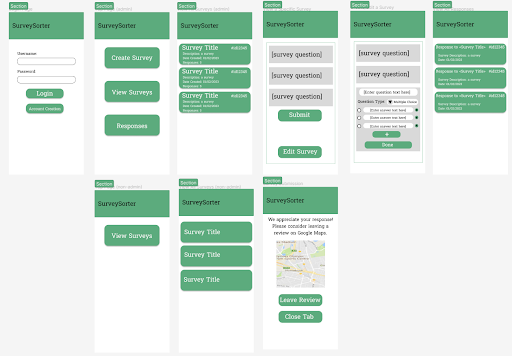

# survey_app_frontend

## Front end link:

- https://survey-sorter-fe.onrender.com/login

- Repo: https://github.com/AppleVine/survey_app_frontend

note: You can use /register to make an account. 
- Username: TestUser4
- Password: TestUser4

## Back end link:

- https://survey-sorter.onrender.com/

- Repo: https://github.com/plutoniumcat/survey-app-backend

## Description of website

### **Purpose:**

The purpose of this website is to provide a convenient and efficient platform for administrators to create customer surveys, collect valuable feedback, and facilitate the generation of online reviews. By offering a user-friendly interface and essential features such as authentication, input validation, and anti-bot measures, the website aims to streamline the process of survey creation and response management. Through this platform, administrators can gain valuable insights from customers without requiring them to create an account, enabling a broader participation base. Additionally, the integration with Google Maps allows survey respondents to seamlessly provide reviews, enhancing the visibility and reputation of the surveyed businesses.

### **Functionality / features:**

**User Authentication:**
 * Staff can create and manage their accounts through a secure login system.
 * User authentication ensures only authorized individuals can access survey creation and response management features.
 * Validation checks to ensure the accuracy and integrity of user inputs, such as appropriate password length, "@" in email and unique usernames.

**Captcha:**
 * Implementation of captcha as an anti-bot measures to prevent automated responses and ensure the authenticity of survey submissions.

**Survey Creation Interface:**
* User-friendly interface for admins to create surveys, including options to add multiple-choice questions, open-ended questions, and rating scales.

**Survey Response Interface:**
* Interface for survey respondents to easily complete surveys without the need for an account.
* Clear instructions and user-friendly design to enhance the respondent experience.
* Intuitive and visually appealing interface design to enhance usability and user satisfaction.

**Database Storage:**
* A database to store surveys and survey responses securely.
* Efficient data management to ensure the integrity and availability of survey data for analysis.

**View Survey Responses:**
* Admins can access a dashboard or interface to view and analyze survey responses.
* [NOT MVP] Ability to filter, sort, and export survey responses for further analysis.

**Integration with Google Maps:**
* Functionality to direct survey respondents to Google Maps after survey completion, facilitating the process of writing reviews for the surveyed businesses.

**Browser Compatibility:**
* Compatibility with major web browsers to ensure a consistent user experience across different devices and platforms.

**Security Measures:**
* Implementation of security measures, such as encryption and secure connections, to protect sensitive data and ensure user privacy.

**Error Handling and Validation Messages:**
* Clear error messages and validation prompts to assist users in resolving any issues or discrepancies during survey creation or response submission.

**Admin Dashboard:**
* A centralized dashboard for admins to manage surveys, view responses, monitor survey activity, and access various administrative functions.

**Responsive Design:**
* A responsive and mobile-friendly layout to ensure optimal user experience on different screen sizes and devices.

**Email Notifications:**
* [NOT MVP] Automated email notifications sent to staff when a survey has recieved feedback from a user. 

**Reporting and Analytics:**
* [NOT MVP] Generation of comprehensive reports and analytics based on survey responses to derive meaningful insights and trends.

**Customization Options:**
* [NOT MVP] Flexibility for admins to customize the appearance of surveys with branding elements, logos, and color schemes.

**Survey Tracking and Status:**
* [NOT MVP] Ability to track survey progress, monitor response rates, and view the status of ongoing and completed surveys.

**Survey Templates:**
* [NOT MVP] Pre-designed survey templates or the option to save and reuse survey formats for convenience and time-saving purposes.

**Data Export:**
* [NOT MVP] Capability to export survey responses and data in various formats, such as CSV or Excel, for further analysis or integration with other systems.

### Target Audience:

The survey site caters to two main groups: staff members and survey respondents. Staff members, who primarily utilize the platform, are responsible for creating and managing surveys on behalf of businesses or organizations. They possess a reasonable level of technical proficiency and work towards gathering customer feedback to gain valuable insights for enhancing products, services, or business operations. These individuals, such as managers, customer experience professionals, and marketing teams, aim to improve customer satisfaction, reputation, and online presence within their respective business/organizational contexts.

On the other hand, survey respondents consist of customers or end-users who provide feedback through the surveys. They represent a diverse range of demographics and willingly share their opinions and experiences regarding the products, services, or interactions they have encountered. The platform ensures a user-friendly experience for survey respondents, allowing them to conveniently complete surveys without the need for creating an account. 

### Tech stack:

The survey site intends to utilize the MERN (MongoDB, Express.js, React.js, Node.js) stack as the foundation of its technology stack. This stack combines popular and robust technologies to create a full-stack web application with seamless integration between the front-end and back-end. React.js will serve as the front-end framework, offering a component-based approach for building interactive user interfaces. Dependencies such as react-dom-router and Bootstrap can be leveraged to enhance navigation and provide a responsive and visually appealing design. For testing purposes, Jest can be employed as a testing framework.

On the back-end, Node.js and Express.js will power the server-side development, allowing for efficient and scalable handling of HTTP requests and responses. Security measures can be implemented using Express Helmet, while CORS ensures proper handling of cross-origin resource sharing. For authentication and authorization, dependencies like JSON Web Token (jsonwebtoken) and bcrypt can be utilized to securely manage user authentication and password hashing. To interact with the MongoDB database, Mongoose provides an elegant and user-friendly way to define data models and perform database operations

----
## Dataflow Diagram

----
## Application Architecture Diagram

----
## User stories

 * As an administrator, I want to be able to assist with password recovery, so that my staff are able to retrieve their accounts should they have issues logging in.

 * As a staff member, I want to be able to create a secure account with a unique username and password, to ensure the integrity and confidentiality of my account information.

 * As a staff member, I want to be able to create a survey, and distribute it ease in order to gather the data I'm looking for. 

 * As a staff member, I want to edit my existing surveys so that I am able to update my questions, or fix any errors to ensure that my survey is up to date.

 * As a staff member, I want to view all existing surveys to stay informed about the ongoing survey activities and gather insights for further analysis and decision-making.

 * As a staff member, I want to view a specific survey so that I am able to analyze the results & feedback. 

 * As a user, I want to submit a survey without the need for an account so that I can conveniently and anonymously provide feedback, encouraging a higher response rate and candid responses

 * As a staff member, I want users to complete a CAPTCHA to ensure data integrity and prevent spam from bots, ensuring that the survey responses are genuine and reliable.

 * As a staff member, I want to provide a link to google maps, so that upon completion of the survey the user is conveniently navigated to leave a review on google and provide feedback about the business.

 * As a user, I want to have both pre-made selectable options and custom feedback, allowing me to provide fast & effective feedback while maintaining the option to provide more detail.  

 * As a staff member, I want to store surveys and responses in the database to review in the future. 

 * As a user, I want access to a contact form to send emails to the relevant staff member, so that I can provide feedback about the survey should I need to.

----
## Wireframes (multiple screen sizes)

- Desktop:

- Mobile:

----
## Google slides:

- https://docs.google.com/presentation/d/1sU9t_2P_R2tnMGCDsezLftCw7KSZZ0gIRXyx8W2WtHw/edit?usp=sharing

## Presentation link:

- https://vimeo.com/851849933/252a4ea9fd

----
## Testing

- https://docs.google.com/spreadsheets/d/1B2JZ5162L1d3MhqkaKtPPHvKB9q-daoTuDMoUXf5jpc/edit?usp=sharing

- https://docs.google.com/spreadsheets/d/13tfmVWXNSZwO7MQO9Hi49CG1Mv4lI_9PHVohrtaX85Q/edit?usp=sharing

- automatic testing scripts for both front end & back end. 

----
## Screenshots of trello board (and other communication)

[Link to working google doc](https://docs.google.com/document/d/1YiiLVyqRXV5_pkDfH3G3K-lAjecy9AhIs0VUIOl5zWE/edit?usp=sharing).

### 28/06/23

### 30/06/23

### 03/07/23

### 05/07/23

### 11/07/23

### 20/07/23

### 25/07/23

### 28/07/23

### 30/07/23

### 02/08/23

### 04/08/23

### 06/08/23

